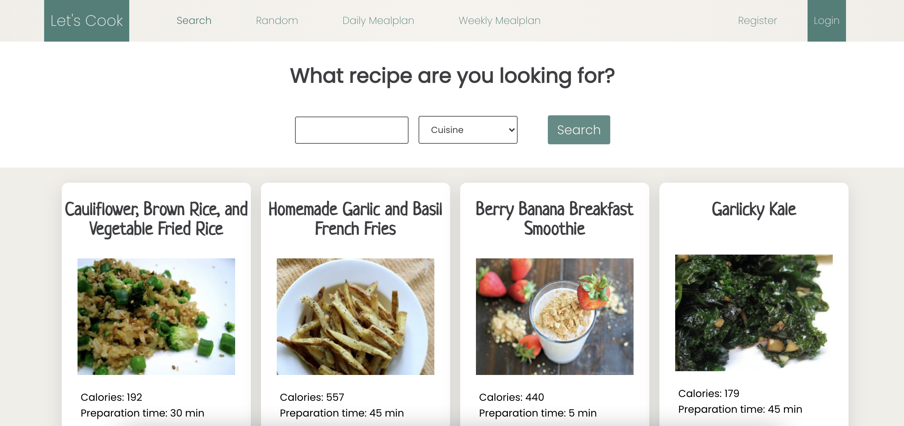

# Recepten applicatie - Frontend eindopdracht NOVI

## Inleiding
Deze recepten applicatie (Let's Cook) is de integrale frontend eindopdracht van NOVI.

Wanneer je even niet weet wat je moet koken of waar je trek in hebt, is deze app perfect voor jou. Met Let's Cook kun je recepten zoeken, random recepten genereren of maaltijdplannen maken voor een dag of een week. Voor een aantal pagina's moet je ingelogd zijn om deze te mogen bezoeken. Je wordt dan vanzelf naar de inlog-pagina geleidt.
De data wordt opgehaald via de recepten API van _Spoonacular_ (`https://spoonacular.com/food-api`).



## Applicatie starten
Clone ten eerste het project naar jouw eigen lokale machine. Wanneer je dit hebt gedaan run je het volgende commando om de `node_modules` te installeren:

```
npm install
```

Wanneer de installatie voltooid is, moet de API key toegevoegd worden in het .env bestand. Zonder deze API key kunnen geen network requests gemaakt worden naar de server van de API. Hoe de API key aangevraagd kan worden, lees je hieronder. Om dit project gemakkelijk na te kunnen kijken, lever ik hieronder de API key mee.

**API KEY:** `a2439dc695ce4d36a6407866d26a3ee9`

### API key aanvragen

Om een API key aan te vragen, doe je het volgende:
1. Ga naar de website van Spoonacular (`https://spoonacular.com/food-api`) en maak hier een account aan. Dit is gratis.
2. Na het invoeren van jouw email adres en wachtwoord, zal je een mail ontvangen met een link om jouw Spoonacular account te activeren. Klik hierop.
3. Log na het klikken op de link in met jouw Spoonacular account.
4. Ga naar 'MY CONSOLE' en klik op 'Profile'.
5. Hier staat jouw API key. Klik op 'Show/Hide API Key' en kopieer deze. Plak hem vervolgens achter de `=` in het `.env` bestand.


Als dit klaar is, run je het volgende commando in de terminal om de applicatie te starten:

```
npm start
```

De browser zal automatisch openen met [http://localhost:3000/](http://localhost:3000/), waarop de applicatie zal draaien.

## Account
Voor een aantal pagina's is het nodig om in te loggen voordat de pagina's bezocht kunnen worden. Om in te loggen, maak je eerst een nieuw account aan. Klik op de knop 'Register' om naar de registreer-pagina te gaan.
Voer hier een gebruikersnaam, geldig emailadres en wachtwoord in. De gebruikersnaam en het wachtwoord bevatten minimaal zes karakters.
Na een succesvolle registratie wordt je doorgestuurd naar de login-pagina, waar je vervolgens met het aangemaakte account kunt inloggen.

Omdat dit project gebruik maakt van de NOVI-backend, is het niet mogelijk om testgebruikers aan te maken. Deze worden namelijk na ongeveer een uur weer verwijderd uit de database.
Om het zo makkelijk mogelijk te maken, geef ik hieronder gegevens van een testgebruiker mee, waarmee een account geregistreerd kan worden:
* **Gebruikersnaam:** testgebruiker
* **Emailadres:** gebruiker@gmail.com
* **Wachtwoord:** wachtwoord

Wanneer een gebruiker is ingelogd, verschijnt zijn gebruikersnaam rechtsboven in de menubalk. Om uit te loggen, klik je op de gebruikersnaam.


## Search Page
[http://localhost:3000/](http://localhost:3000/)

Op deze pagina kun je recepten zoeken op naam of op keuken. Zonder iets in te voeren, toont de pagina twaalf standaard recepten waar je uit kunt kiezen.
Voer in het inputveld de naam in van het recept dat je zoekt. Maximaal twaalf recepten zullen verschijnen. Wanneer je zoekt op keuken hoef je niets in te voeren in het tekstveld.
Als niets is ingevoerd én er is geen keuken gekozen, is de zoek-knop _disabled_ en kun je hier niet op klikken.

Wanneer je een recept gevonden hebt, klik je op de knop _Go to recipe_. Je zult naar de site gebracht worden waar dit recept te vinden is.


## Random Page
[http://localhost:3000/random](http://localhost:3000/random)

Weet je echt niet waar je trek in hebt? Of zoek je iets wat je nog nooit gegeten hebt? Dan is deze pagina voor jou een uitkomst.
Met één druk op de knop wordt een random recept gegenereerd. De pagina geeft aan wat de bereidingstijd is en hoeveel porties het recept bevat. Daarnaast toont de pagina een lijst van ingrediënten en van de stappen die nodig zijn om het recept te maken.
Denk je na alles gelezen te hebben; 'Dit wil ik toch niet..', dan klik je gewoon nogmaals op de 'Generate' knop onderaan de pagina om een nieuw recept te genereren.


## Daily Mealplan Page
[http://localhost:3000/daily](http://localhost:3000/daily)

**Belangrijk:** Om deze pagina te mogen bezoeken, moet je ingelogd zijn met jouw account.

Is één random recept voor jou niet genoeg? Dan genereer je op deze pagina gemakkelijk een maaltijdplan voor een hele dag. Voer in het tekstveld het aantal gewenste calorieën voor de gehele dag in en kies een dieet (niet noodzakelijk).
Het minimale aantal calorieën is 250. Na het drukken op de 'Create' knop, toont de pagina drie gerechten voor de hele dag en worden de macro's weergegeven. 
Om ieder gerecht te bekijken, klik je weer op de 'Go to recipe' knop op het recept. Deze leidt je naar de website waar het complete recept te vinden is. 


## Weekly Mealplan Page
[http://localhost:3000/weekly](http://localhost:3000/weekly)

**Belangrijk:** Om deze pagina te mogen bezoeken, moet je ingelogd zijn met jouw account.

Deze pagina werkt precies op dezelfde manier als de 'Daily Mealplan Page', maar geeft recepten voor de hele week terug. Weer worden drie recepten per dag getoond, maar nu voor iedere dag in de week.
